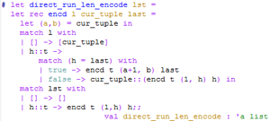
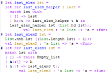

# 99 Problems (Ocaml and Python) #

## Summary ##

99 Problems is a collection of short problems dealing with different data structures and algorithms, to which I provide multiple solutions in Ocaml and Python.

## Description ##

Edit (March 2013): Looking back over old code is both enlightening and embarrassing: it can show how crappy of a programmer you once were, while also letting you know that despite how confident you are in your skills, you're probably still a crappy programmer. That said, this is pretty awful code. I spruced up the first few list functions, but the rest is just bad. I'll make more changes over the summer of 2013. 

Original post: First project! 99 Ocaml Problems is pretty fun and I highly recommend it. It's based on [99 Prolog Problems](https://sites.google.com/site/prologsite/prolog-problems), which was developed by Werner Hett while he was teaching at Biel-Bienne in Switzerland. 

Basically, each problem can be solved with a short function. Problems deal with lists, trees, and other data structures. I did these over the spring semester of my sophomore year, so I didn't have time to complete all of them. I will probably complete the rest of them later on. 

You can learn more about 99 Problems in Ocaml by clicking [here](http://www.christiankissig.de/cms/index.php/programming/217-99-problems-in-ocaml).

## Screenshots ##

  
